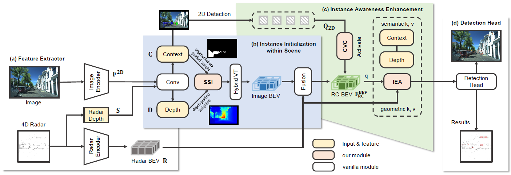
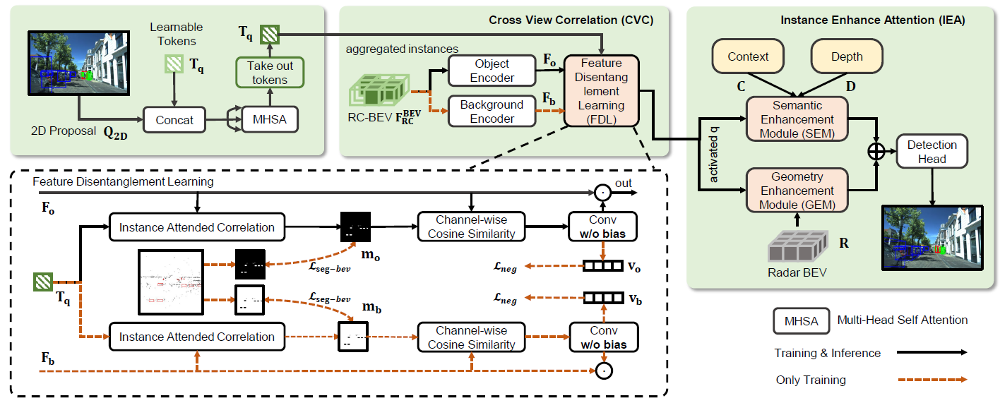
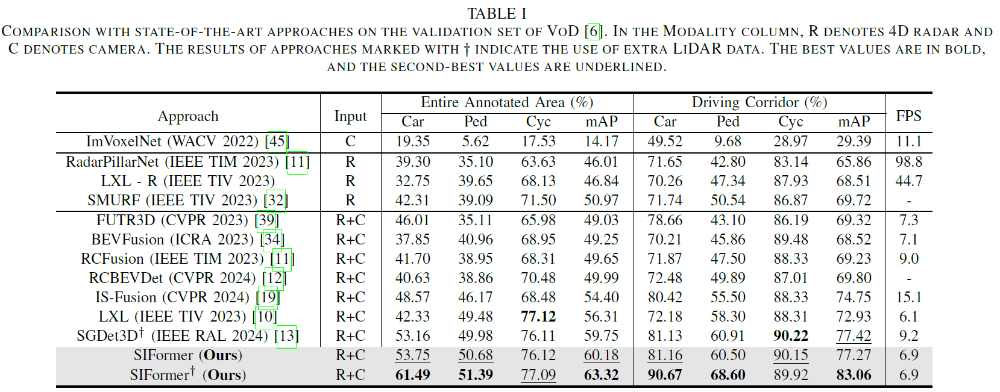
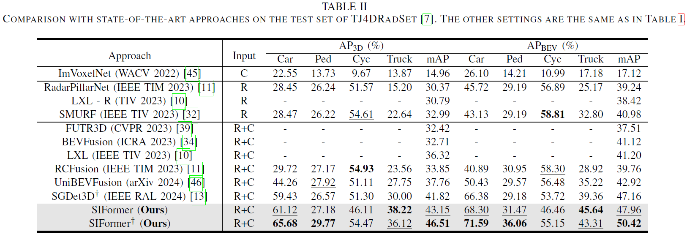
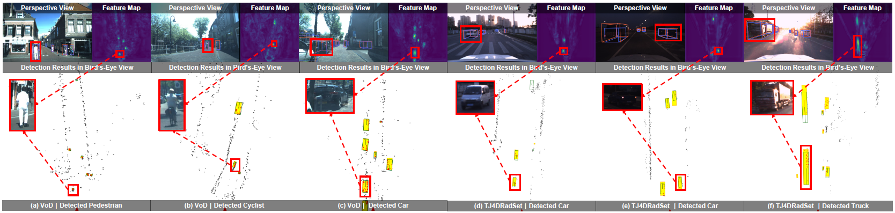
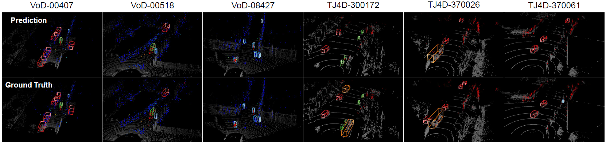
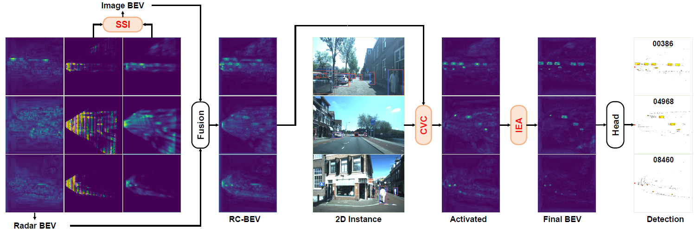

# SIFormer: Boosting Instance Awareness via Cross-View Correlation with 4D Radar and Camera for 3D Object Detection

## 🗓️ News
- **2025.12.11** TMM accepted
- **2025.07.31** code v1.0 released
- **2025.07.20** TMM minor revision

## 📜 Abstract
 
4D millimeter-wave radar has emerged as a promising sensor for autonomous driving due to its affordability and robustness. However, existing radar-camera fusion approaches typically adopt either BEV-level or perspective-level fusion, each with limitations and lacking a bridging mechanism. BEV-level fusion provides global context but weak instance focus, while perspective-level fusion captures instance details but lacks holistic scene understanding. To address these, we propose SIFormer, a scene-instance aware transformer for 3D object detection using 4D radar and camera. SIFormer first filters out irrelevant features during view transformation via segmentation and depth-guided localization to focus on regions of interest. It then enhances instance awareness through cross-view correlation, enabling effective interaction between BEV and perspective features. Finally, a transformer-based fusion module aggregates image semantics and radar geometry for robust perception. As a result, with the aim of enhancing instance awareness, SIFormer bridges the gap between the two paradigms, combining their complementary strengths to improve detection accuracy. Experiments demonstrate that SIFormer achieves state-of-the-art performance on radar-camera fusion benchmarks.

## 🛠️ Method

Architecture of our SIFormer. (a) The feature extractor extracts 4D radar and image feature from raw data. (b) The instance initialization stage filters out irrelevant features during view transformation via segmentation and depth-guided localization to focus on regions of interest introduces, while achieving global scene understanding. (c) The instance awareness enhancement stage leverages cross view correlation (CVC) to bridge perspective view instance feature with bird’s-eye view scene feature, followed by the instance enhance attention (IEA) module for further refinement, producing fused feature across scene and instance levels. (d) The decoder head for 3D object detection.

The illustration of our instance awareness enhancement stage. We first employ cross view correlation (CVC) to activate all potential regions of interest within scene feature using a learnable token. To be specific, the instance attended correlation connects the aggregated instances with the RC-BEV through matrix operations, producing a correlation map, which is then used to calculate the cosine similarity with the scene feature. Consequently, the output of CVC serve as improved queries for the subsequent instance enhance attention (IEA), facilitating further aggregation of semantics and geometry.

<!-- ## 🍁 Quantitative Results

 --> 

## 🔥 Getting Started

step 1. Refer to [Install.md](./docs/Guidance/Install.md) to install the environment.

step 2. Refer to [dataset.md](./docs/Guidance/dataset.md) to prepare View-of-delft (VoD) and TJ4DRadSet (TJ4D) datasets.

step 3. Refer to [train_and_eval.md](./docs/Guidance/train_and_eval.md) for training and evaluation.

<!-- ## 🚀 Model Zoo

We retrained the model and achieved better performance compared to the results reported in the tables of the paper. We provide the checkpoints on View-of-delft (VoD) and TJ4DRadSet datasets, reproduced with the released codebase.

|                           Dataset                            | Backbone | Model | EAA 3D mAP | DC 3D mAP |                        Model Weights                         |
| :----------------------------------------------------------: | :------: | :--------: | :--------: | :-------: | :----------------------------------------------------------: |
| View-of-delft | ResNet50 | LXL      |  56.31    |   72.93   | Link |
| View-of-delft | ResNet50 | SGDet3D  |  59.75    |   77.42   | Link |
| View-of-delft | ResNet50 | SIFormer |  63.32    |   83.06   | Link |
| TJ4DRadSet    | ResNet50 | LXL      |  36.32    |   41.20   | Link |
| TJ4DRadSet    | ResNet50 | SGDet3D  |  41.82    |   47.16   | Link |
| TJ4DRadSet    | ResNet50 | SIFormer |  46.51    |   50.42   | Link | -->

### 😙 Acknowledgement

Many thanks to these exceptional open source projects:
- [BEVFormer](https://github.com/fundamentalvision/BEVFormer)
- [DFA3D](https://github.com/IDEA-Research/3D-deformable-attention.git)
- [mmdet3d](https://github.com/open-mmlab/mmdetection3d)
- [VoxFormer](https://github.com/NVlabs/VoxFormer.git)
- [OccFormer](https://github.com/zhangyp15/OccFormer.git)
- [SDGet3D](https://github.com/shawnnnkb/SGDet3D)

As it is not possible to list all the projects of the reference papers. If you find we leave out your repo, please contact us and we'll update the lists.

## ✒️ Citation

If you find our work beneficial for your research, please consider citing our paper and give us a star. If you encounter any issues, please contact shawnnnkb@zju.edu.cn.

## 🐸 Visualization Results

Visualization results on the VoD validation set ((a),(b),(c)) and TJ4DRadSet test set ((d),(e),(f)). Each figure corresponds to a frame. Orange and yellow boxes represent ground-truths in the perspective and bird's-eye view, respectively. Green and blue boxes indicate predicted results.

Qualitative presentation of SIFormer. The first row is prediction and the second row denotes the ground truth. White dots represent LiDAR, while colored dots represent 4D radar, with color differences indicating velocity variations. The comparison highlights the effectiveness of our SIFormer.

Visualization of the interactions between key components in the SIFormer: Sparse Scene Integration (SSI), Cross-View Correlation (CVC), and Instance Enhance Attention (IEA). The figure shows how feature maps are progressively fused and processed, resulting in the activation of instances and the final detection output. Notably, the CVC mechanism reduces noise from the 4D radar and mitigates blurriness caused by inaccurate view transformations, thereby enhancing the clarity of instance-related regions. Zoom in for better view.